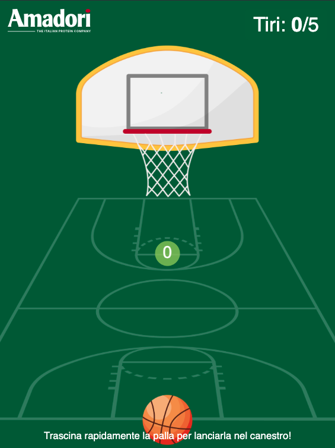

# Amadori Basketball

La repo è un fork di [http://bonbonlemon.github.io/basketball/](http://bonbonlemon.github.io/basketball/)

Il gioco è ottimizzato per un device aventi dimensioni 810x1080 (WxH).
E' stata testata la visualizzazione su:
- iPad 7
- iPad Air 5° generazione

Il gioco è sviluppato con JavaScript, Phaser, e Canvas.

## Features 
Rispetto alla repo base, ci sono le seguenti feature aggiuntive:
- Responsive mantenendo un aspect ration del canvas in modalità portrait;
- Pagina introduttiva e pagina di gameover;
- Massimo impostabile del numero di tiri;
- Contatore in game del numero di tiri eseguiti;

